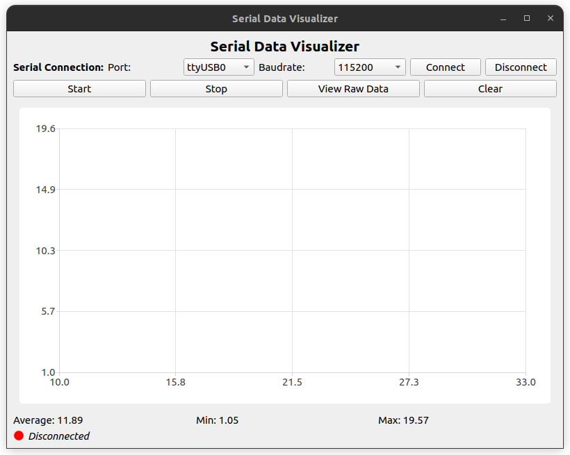
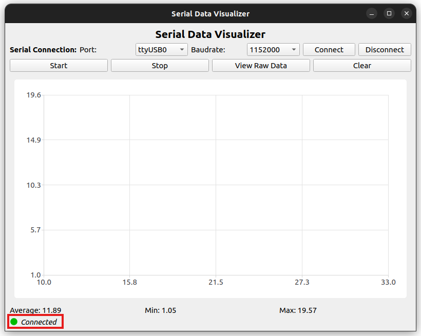
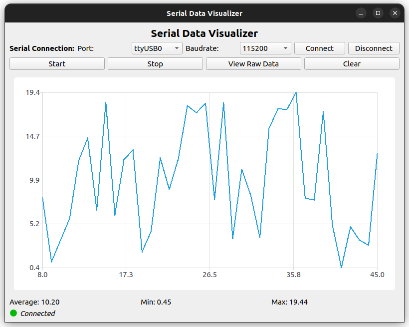
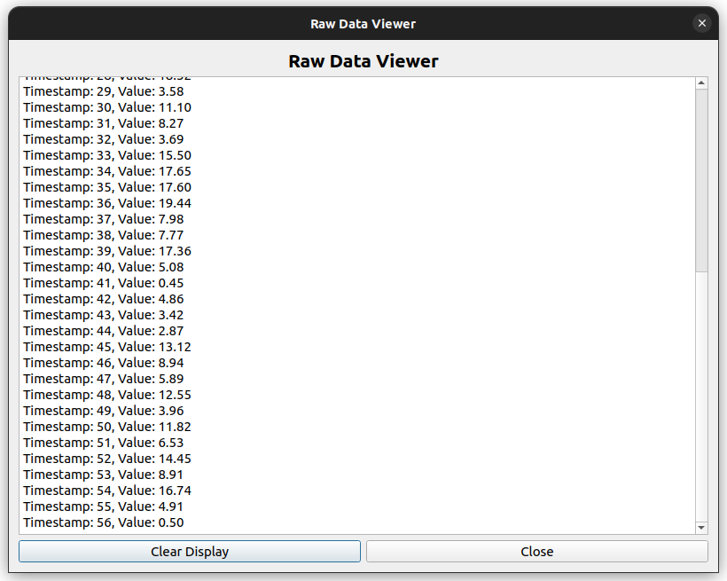

# Documentation

This folder contains user guidelines for the Serial Data Visualizer application. Below is a step-by-step guide to help you fully utilize the application's features.

---

## How to Use the Application

### 1. Run the Application
You can run the application using one of the following methods:
- Open the project in **Qt Creator**, build the application, and click **Run**.
- Use the pre-built application by:
  - Running the installer from the **installer** folder.
  - Executing the extracted binary from `serial_data_visualizer_windows` (Windows) or `serial_data_visualizer_ubuntu` (Linux).

#### Main Application Window Examples
- **Windows:**
  
- **Linux:**
  

---

### 2. Connect the Device
1. Connect your ESP32 device to your computer using a USB cable.
2. Ensure the device is properly powered and recognized by your operating system.

---

### 3. Configure and Establish the Connection
1. Open the application.
2. Select the appropriate **serial port** and **baudrate** from the dropdown menus.
3. Click **Connect** to establish a connection between the application and the device.
4. Once connected, the status will update to **Connected**.

#### Examples:
- **Windows:**
  
- **Linux:**
  

> ⚠️ **Note:** Ensure you select the correct port and baudrate before connecting. An empty selection will result in a connection failure.

---

### 4. Start Data Streaming
- Click the **Start** button to begin receiving and visualizing data.
- The application will display real-time data on a chart, with raw data queued for analysis.

#### Examples:
- **Windows:**
  
- **Linux:**
  

---

### 5. View Raw Data
- Click **View Raw Data** to open a window displaying incoming raw data, including timestamps and values.
- This feature allows you to analyze raw information directly.

#### Examples:
- **Windows:**
  
- **Linux:**
  

---

### 6. Stop Data Streaming
- Click the **Stop** button to pause or stop the data streaming process.

---

### 7. Clear the Display
- Use the **Clear** button to reset and clear the data displayed on the chart and raw data queue.

---

## Additional Notes
- Ensure that your ESP32 device is flashed with the correct firmware provided in the **serial_port_device/esp32_serial_data_simulation** folder.
- For further insights into design decisions, challenges faced, and lessons learned, refer to the **design reflection** document in this folder.
