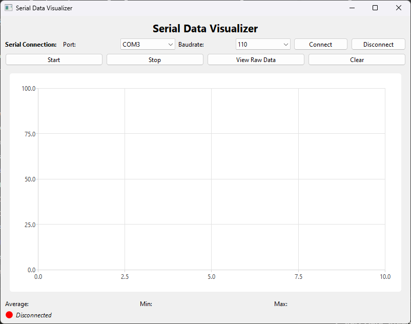
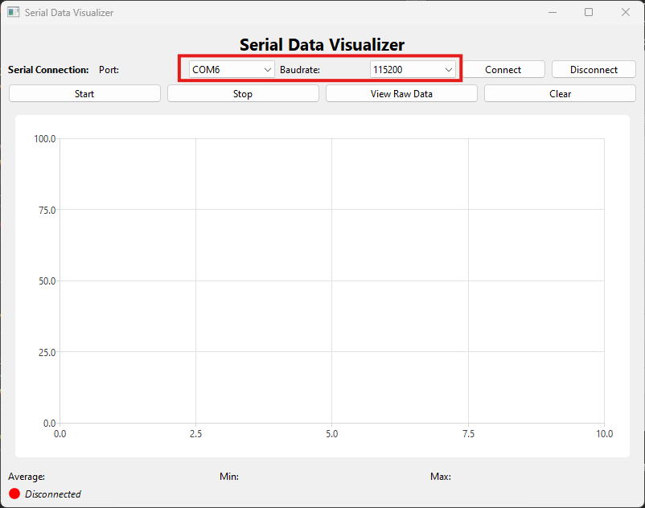
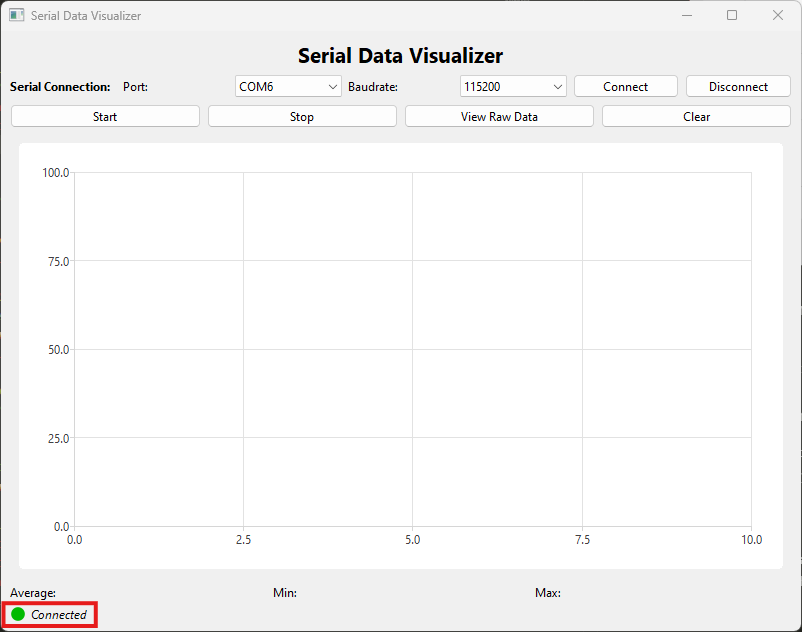
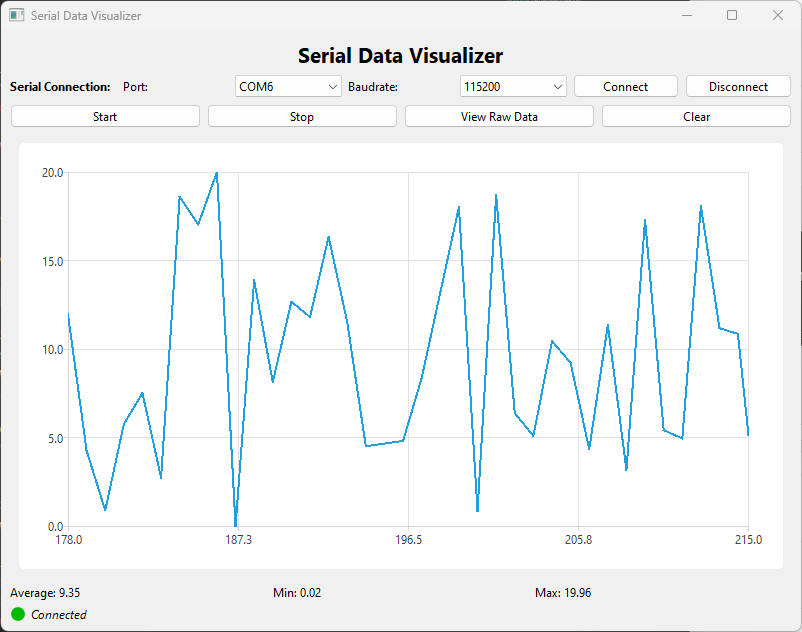
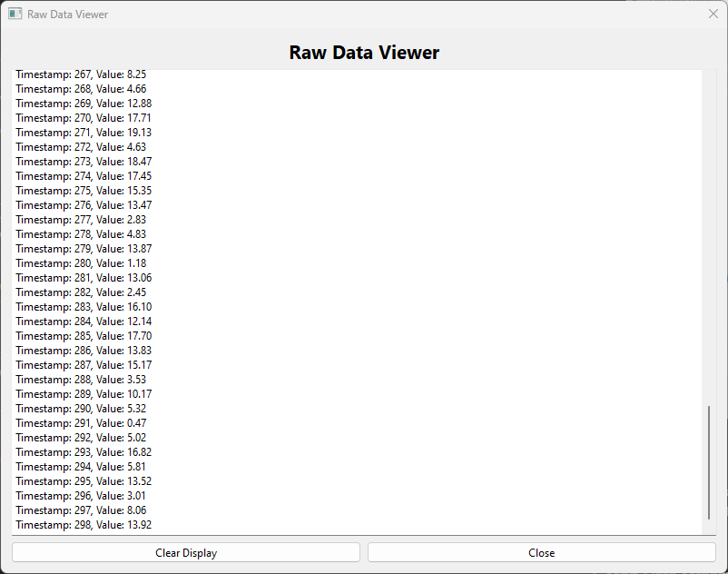

# Documentation

This folder contains the guidelines for using the Serial Data Visualizer application. Below is a step-by-step guide to help you fully utilize the application's features.

## How to Use the Application

### 1. Run the Application
You can run the application using one of the following methods:
- Open the project in **Qt Creator**, build the application, and click **Run**.
- Use the pre-built application by running the installer from the **installer** folder or the extracted executable from the `serial_data` folder.
- The application showing like this image

### 2. Connect the Device
- Connect your ESP32 device to your computer using a USB cable.
- Ensure the device is properly powered and recognized by your operating system.

### 3. Configure the Connection
- Open the application.
- Select the appropriate **serial port** from the dropdown menu.
- Choose the correct **baudrate** that matches your ESP32 configuration.
- The serial port and baudrate showing with this image in red squreline

### 4. Establish the Connection
- Click the **Connect** button to establish a connection between the application and the device.
- Once connected, the application will update the status to "Connected".

### 5. Start Data Streaming
- Click the **Start** button to begin receiving and visualizing data from the ESP32.
- Data will be displayed on the chart in real-time, and raw data will be queued for viewing.

### 6. View Raw Data
- Click **View Raw Data** to open a window displaying the incoming raw data.
- This window will show timestamps and data values, allowing you to analyze the information directly.

### 7. Stop Data Streaming
- Click the **Stop** button to stop the data streaming process.

### 8. Clear the Display
- Use the **Clear** button to reset and clear the data displayed on the chart and raw data queue.

## Additional Notes
- Ensure that your ESP32 device is flashed with the correct firmware provided in the **serial_port_device/esp32_serial_data_simulation** folder.
- Refer to the design reflection document in this folder for insights on design decisions, challenges faced, and lessons learned.